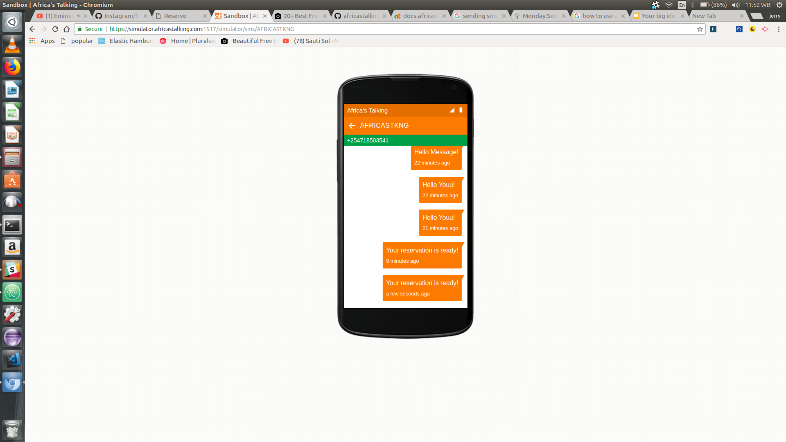
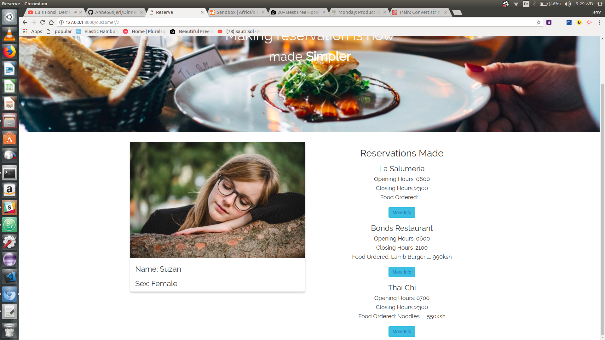
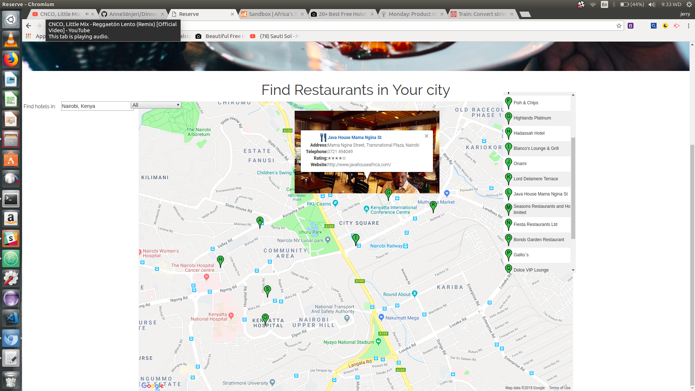

## Reserve
An app bulid using Django a python framework  

- Alert Message

- Driver Profile Page

- Directions map

## Author name
Maryanne  Njeri

## Project Description

- Reserve is an app that allows you to search for restaurants in the city your give you directions to the restaurant
-  Allows you to make a reservation in the restaurant in your city and order food thus on arrival you don't
   to wait for your food to be prepared
- An SMS is sent to your phone once your reservation is ready
- Also alerts you on your total bill
- It helps one save time

## Project setup instructions:
- Install Django1.11 and Python 3.6

- Git clone repo then you will need to install venv that is a  virtual enviroment and run source virtual/bin/activate
- Then pip freeze > requirements.txt

- open http://127.0.0.1:8000/ on your browser to view on the localhost

- To watch a live demo of the app click the link below
https://www.youtube.com/watch?v=eP_y8SpS3KA&feature=youtu.be

## Technology used:
- Python3.6
- Django
- Bootstrap 3
- HTML5/CSS
- postgresql
- Google Maps Javascript api
- Javascript
- African's talking Api

## Copyright and License information:
Her  project is licenced under the MIT License.

Permission is hereby granted, free of charge, to any person obtaining a copy of this software and associated documentation files (the "Software"), to deal in the Software without restriction, including without limitation the rights to use, copy, modify, merge, publish, distribute, sublicense, and/or sell copies of the Software, and to permit persons to whom the Software is furnished to do so, subject to the following conditions:

The above copyright notice and this permission notice shall be included in all copies or substantial portions of the Software.

THE SOFTWARE IS PROVIDED "AS IS", WITHOUT WARRANTY OF ANY KIND, EXPRESS OR IMPLIED, INCLUDING BUT NOT LIMITED TO THE WARRANTIES OF MERCHANTABILITY, FITNESS FOR A PARTICULAR PURPOSE AND NONINFRINGEMENT. IN NO EVENT SHALL THE AUTHORS OR COPYRIGHT HOLDERS BE LIABLE FOR ANY CLAIM, DAMAGES OR OTHER LIABILITY, WHETHER IN AN ACTION OF CONTRACT, TORT OR OTHERWISE, ARISING FROM, OUT OF OR IN CONNECTION WITH THE SOFTWARE OR THE USE OR OTHER DEALINGS IN THE SOFTWARE.* CopyRight(c) 2017 MaryAnneNjeri
